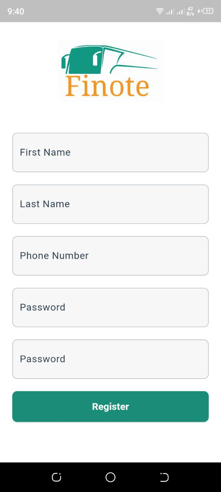
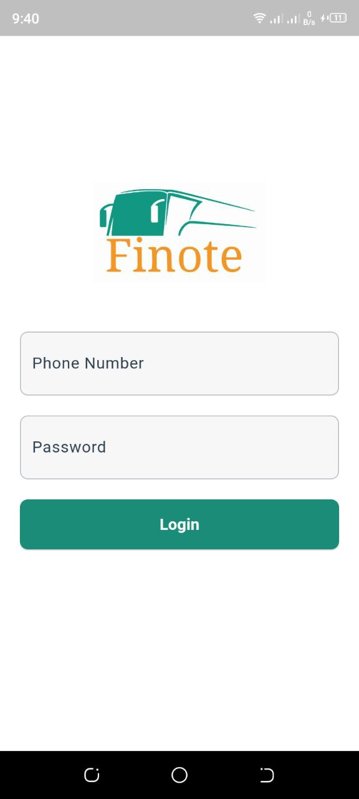
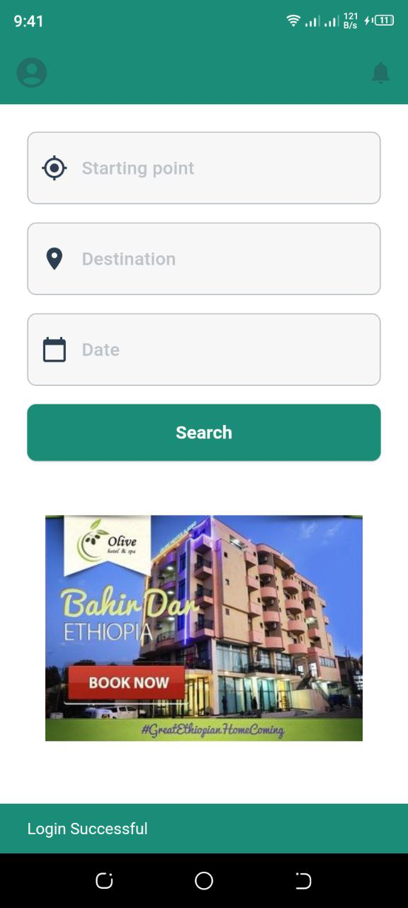
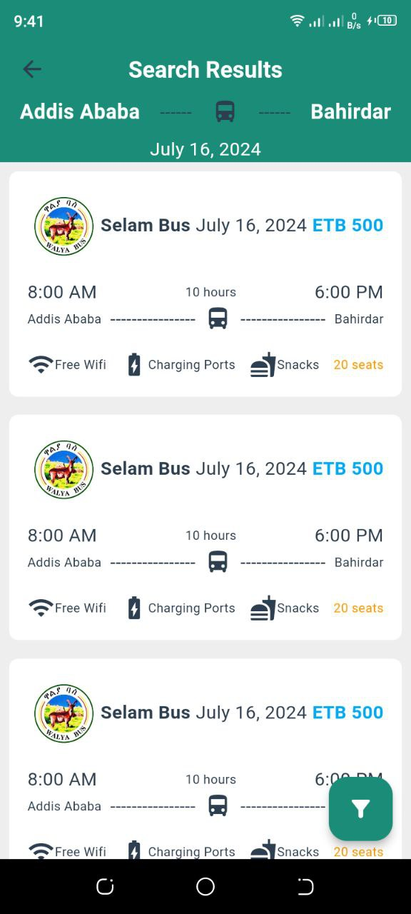
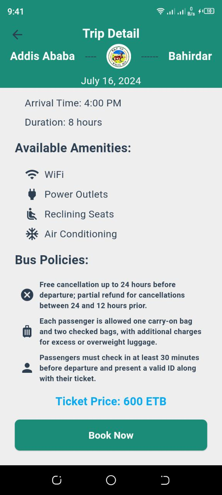
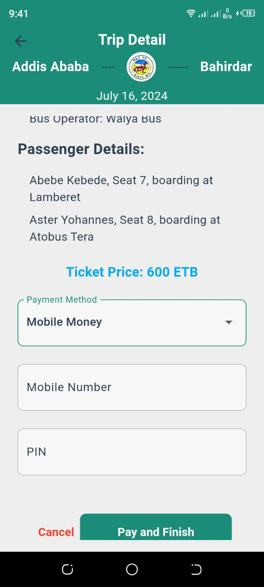
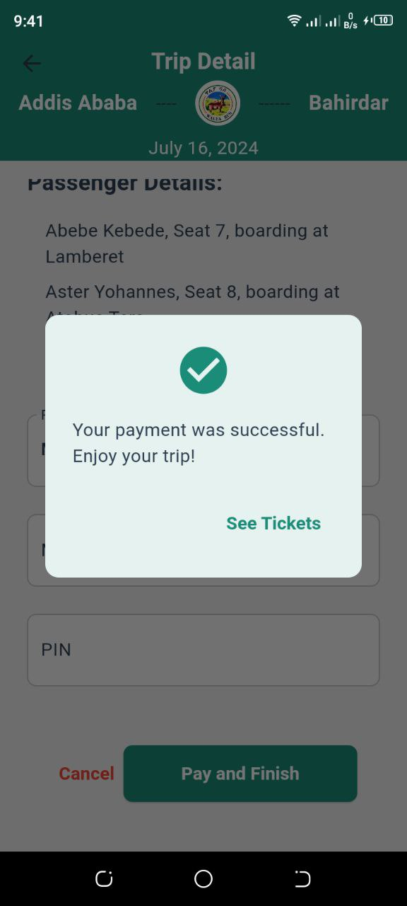
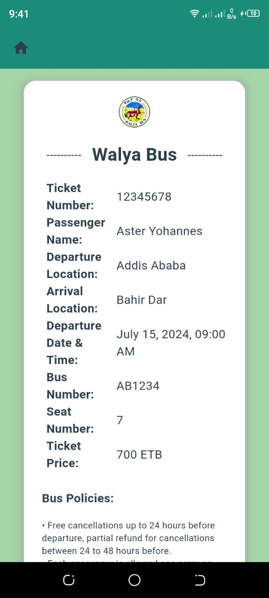
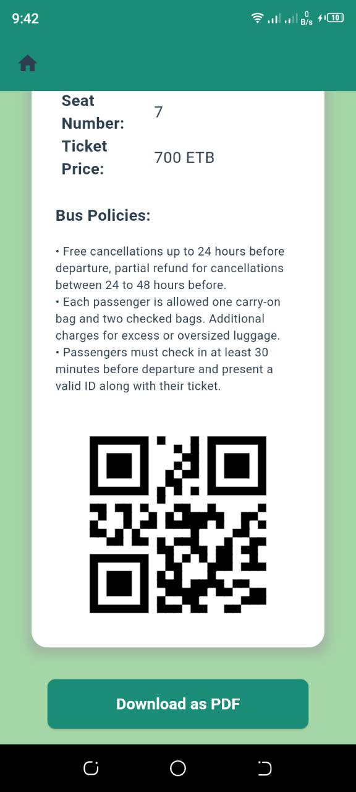

# Finote

## Finote - Cross-Country Bus Ticketing App

Finote is a mobile application designed to revolutionize bus travel in Ethiopia by allowing travelers to purchase tickets easily from their convenience and enabling bus operators to simplify their operations and increase ticket sales. Our app features user-friendly interfaces, secure payment methods, and real-time schedule management. Join us in making bus travel more efficient and accessible for everyone!

<table>
  <tr>
  </tr>
  <tr>
    <td></td>
    <td></td>
  </tr>

  <tr>
    <td></td>
    <td></td>
  </tr>
  

  <tr>
    <td></td>
    <td></td>
    <td></td>
  </tr>
  
  <tr>
    <td></td>
    <td></td>
  </tr>
        
 </table>
 
## Table of Contents

- [Features](#features)
- [Installation](#installation)
  - [Backend](#backend)
  - [Mobile Application](#mobile-application)
- [Usage](#usage)
  - [Booking Tickets](#booking-tickets)
  - [Admin Dashboard](#admin-dashboard)
- [API Documentation](#api-documentation)
- [Contributing](#contributing)
- [License](#license)
- [Contact](#contact)

## Features

- User authentication and authorization
- Browse available bus routes and schedules
- Book tickets and view booking history
- Admin dashboard for managing routes, schedules, and bookings
- Real-time notifications and updates
- Mobile application for on-the-go access

## Installation

### Backend

1. Clone the repository:
   ```bash
   git clone https://github.com/your-username/easybus.git
   cd easybus/backend
2. Install Depenedencies:
    ```bash
    npm install
3. Setup Environment variables:
   create `.env` file in the backend directory and add the necessary configuration.
   ```bash
   DATABASE_URL=<your-database-url>
   JWT_SECRET=<your-jwt-secret>'
4. Run the server:
   ```bash
   npm start
### Mobile Application
1. Navigate to the mobile directory:
   ```bash
   cd ./mobile
2. Install dependencies:
   ```bash
   flutter pub get
3. Run the application:
   ```bash
   flutter run
### Usage
#### Booking Tickets
"1.". Register or log in to your account.
"2.".Browse available bus routes and schedules.
"3.".Select a route and book a ticket.
"4.".View your booking history and manage your tickets
